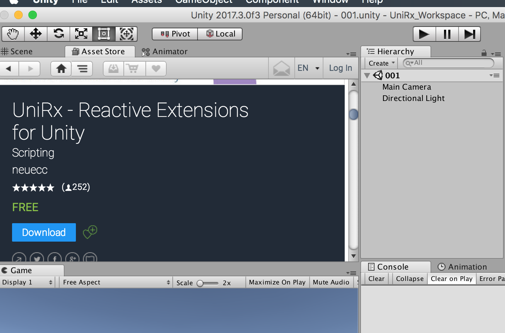
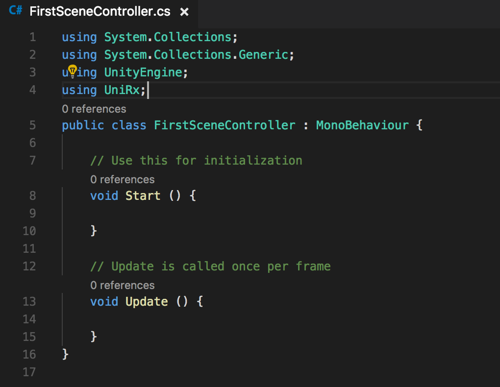

今回から実際にコードを書いて動かしてみようと思います。
<!--more-->
### アセットストアからUniRxをインポート
---
アセットストアですぐに見つかります。 

    
追加したら, ``using``を忘れずに。


### Subjectを使ってみる。
---
ストリームソースとなりうるものです。
初期化はこんな感じで,
```csharp
Subject<T> hogehoge = new Subject<T>();
```

例えば    
```csharp
Subject<string> text = new Subject<stirng>();
```
上記の例だと、stringの値が流れてくるストリームソースの作成に成功です。
        

ストリームに値が流れたときの処理は,
    
``
Subscribe();
``    
を使います。
ストリームに値を流すときは,
    
``
onNext();
``
    
で流せます。
```csharp
using UnityEngine;
using UnityEngine.Events;
using UniRx;
public class FirstSceneController : MonoBehaviour
{
    Subject<string> text = new Subject<string>();
    // Use this for initialization
    void Start()
    {
        text
            .Subscribe(x => Debug.Log(x));

        text.OnNext("hello, Subject");
    }
}
```
Start関数内で、購読の処理(subscribe)とストリームに値を流す処理を書いています。    
この後、onNextは値を変えたり、呼ぶタイミングを変えたりしながら、Subjectが破棄されるまで何回でも呼ぶことができます。

### click eventをストリームにしてみる。
---
UniRxを使えば、uGUIのクリック処理を以下のように書くことができます。
```csharp
using UnityEngine;
using UnityEngine.UI;
using UniRx;
public class FirstSceneController : MonoBehaviour
{
    [SerializeField] Button button01;
    // Use this for initialization
    void Start()
    {
        button01.OnClickAsObservable()
            .Subscribe(
                _ => Debug.Log("clicked"));
    }
}
```
ストリームに値が入っていないときは    
``_ => ``    
とするのが通例のようです。
これだけで、シーン上にあるボタンがクリックされたときに、ログを出力できます。
    
例えば、ログだけじゃなく、数行にわたる処理を書きたいときは,    
```csharp
.Subscribe(_ => Debug.Log("clicked"));
```    
の部分を,    
```csharp
.Subscribe(_ => {    
    Debug.Log("log1");    
    Debug.Log("log2");    
});
```    
としてあげれば複数行の処理を記述することができます。
